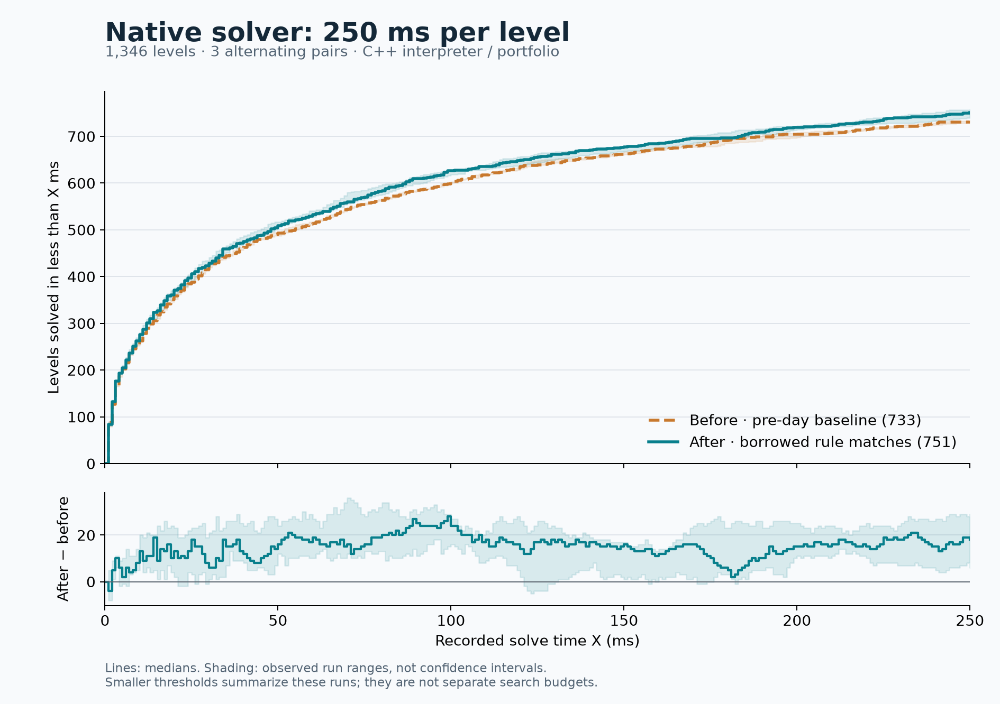

# Native rule matching: remove allocation before adding analysis

This experiment starts from **528bdf78**, before the September 6 work. It changes
the C++ interpreter's match storage, with no new invariants, per-level analysis,
input-flow plans, search heuristic, or game-specific assumptions.

The result is a useful execution improvement, **not a breakthrough in search
capability**. Three fixed-work pairs take **26.6–31.6% less process time**. Three
native 250 ms battery pairs gain **6, 17, and 29** strict-cutoff solves. The median
paired gain is 17; separate median totals are **733 → 751 of 1,346 levels**.

## What changed

1. Single-row binding capture previously constructed a nested vector containing
   just one match position. Its initializer-list construction allocates an inner
   vector, outer storage, and another inner vector copy. Use a stack array instead.
   Ellipsis capture borrows its already-collected positions through a span.
   Both binding-capture calls still run, including clearing old captures and
   capturing before any replacement. Internal templates support these views;
   public runtime types and APIs are unchanged.
2. Ordinary multi-row rules previously materialized the full Cartesian product
   of their row matches, repeatedly copying nested vectors. Keep the original
   match snapshots and visit combinations through an index cursor. Additional
   tuple storage is now proportional to the number of rows instead of the number
   of combinations. The combinations themselves are still visited.

Row zero advances fastest, exactly as in the old construction. The first tuple
retains its existing treatment; every later tuple is revalidated against the
current board before capturing bindings and replacing cells. Commands remain
queued once after the replacement loop. Random-group candidate collection and
selection are unchanged. There is no rule-group splitting or new scheduling.

The solver, generator, and player all use this interpreter. The measurements below
are solver measurements; they do not establish an equivalent generator speedup
or any improvement in generated-level quality.

## Fixed-work ablation

All 184 source files / 1,346 playable levels, production native BFS, zero heuristic,
100 expansions per level, one process, 60-second per-level safety deadline. A wall
deadline before the expansion cap fails the harness. Compilation, loading, and
player-runtime replay are included in process wall time.

Both comparison drivers compile the same search source and link different native
runtime/compiler libraries. For **every pair**, status, expansions, generated
states, unique states, duplicates, frontier size, and the complete solution are
identical on all 1,346 levels. Every solved path also passes player-runtime replay.
Each pass has 176 solved levels, 1,163 expansion-capped levels, and 7 exhausted.

| Change | Pair | Baseline ms | Candidate ms | Less time |
| --- | ---: | ---: | ---: | ---: |
| Borrow single-row / ellipsis captures only | 1 | 71,721.1 | 60,719.2 | 15.3% |
| Capture only | 2 | 71,133.7 | 61,195.7 | 14.0% |
| Capture only | 3 | 72,043.8 | 61,837.4 | 14.2% |
| Capture + streamed multi-row tuples | 1 | 67,380.1 | 49,427.8 | 26.6% |
| Capture + streamed tuples | 2 | 69,452.8 | 48,154.7 | 30.7% |
| Capture + streamed tuples | 3 | 71,038.8 | 48,602.4 | 31.6% |

Each variant was measured with one initial pair and then a two-pair repeat batch.
Each batch has a full warmup of each binary; the repeat batch alternates pair
order. Do not treat these as uniformly alternating six pairs, or subtract their
percentages as an exact independent contribution from streaming. Before the final
repeat, the benchmark driver switched to the production JSON string serializer;
both sides were rebuilt identically. Search/runtime code was unchanged.

The fixed-work result is an aggregate over this workload, not a promise of a
26–32% improvement for every game. Expensive cases can dominate the total.

## Actual 250 ms solve battery

Standard native portfolio, interpreter only, one worker, normal timing defaults.
No generated kernels are linked. Count a level only if `status == solved` and
`elapsed_ms < 250`; replay or a final expensive operation can exceed the nominal
budget, so nominal solved totals are recorded separately.

| Pair / order | Strict before → after | Net | Nominal before → after |
| --- | ---: | ---: | ---: |
| 1 / before, after | 733 → 739 | +6 | 735 → 742 |
| 2 / after, before | 734 → 751 | +17 | 735 → 756 |
| 3 / before, after | 729 → 758 | +29 | 732 → 759 |

All runs cover the same 1,346 playable levels, with no level errors. Baseline
process wall times are 188.0, 188.3, and 189.1 seconds; candidate times are 186.4,
184.7, and 183.1 seconds. Deadline-limited runs spend most of their time on levels
that still time out, so their total wall time cannot measure execution throughput.



| Recorded threshold | Median before → after |
| --- | ---: |
| <10 ms | 263 → 276 |
| <50 ms | 493 → 509 |
| <100 ms | 603 → 627 |
| <250 ms | 733 → 751 |

These are cumulative times within the 250 ms runs, not fresh searches at each
smaller budget. Lines are medians; bands are observed run ranges, not confidence
intervals. The lower line subtracts the displayed medians; its band covers the
observed paired differences. Three pairs establish a promising direction, not a
precise long-run gain estimate.

Ten levels fail the strict cutoff in every baseline observation and pass it in
every candidate observation; none consistently move in the opposite direction.
Source level indices are zero-based:

- BIAXIAL INVASION OF SATURN: 13
- Match-Maker: 7
- alternatey: 4
- car crash: 2
- collapse: 2
- hedgehog stimulator: 5, 13
- heroes_of_sokoban_2: 13, 26
- pipe puffer: 8

## Correctness and build controls

- All **470 recorded gameplay tests pass** through the native interpreter.
  These include ellipsis invalidation, property handling, random determinism,
  rigid movement, and repeated turns.
- Native player API tests pass.
- Six focused rule-matching cases pass in both player and solver modes, including
  undo and restart. They cover three-row Cartesian order, invalidated overlapping
  matches, cross-row property capture, a missing row, ellipsis capture, and
  single-row capture. The order fixture would produce `abbP` instead of `bbaP`
  with reversed enumeration; the invalidation fixture would produce `bbcP`
  instead of `cccP` without revalidation.
- The same focused tests pass against the untouched baseline libraries. Expected
  behavior was not defined by the optimized implementation.
- Focused tests also pass with **32-bit mask words**. Benchmarks use 64-bit words.
- Windows x64, MSVC 19.44.35207.1, Release `/MD /O2 /Ob2 /DNDEBUG`, no linked
  generated rules. Runs are serial, without simultaneous builds or other
  benchmarks. The deadline harness clears `PUZZLESCRIPT_*` overrides; none were
  set for the initial fixed-work batches, and the final harness clears them too.

## What happens to today's work

Keep the earlier branch intact as an experiment record. This patch is independent
of its speculative solver/runtime changes. GitHub was refreshed before packaging:
`origin/master` is `fb1fd820`. The merged PRs #10 and #11 contain generator fixes,
replay validation, and budget/cancellation handling; their compiler and interpreter
are byte-identical to 528bdf78. Those merged fixes do not need to be reverted to
apply this runtime patch. The unmerged draft #12 can be evaluated separately.

The measured executables use the **pre-day search driver** on both sides. These
numbers isolate this patch; they are not a benchmark of a future merge combining
it with every later solver change. No shared history has been rewritten.

## Evidence and reproduction

- [Complete compressed evidence](benchmarks/2026-09-06-native-tuples-evidence.json.gz):
  full fixed-work results, all native deadline results and solutions, source and
  executable hashes, warmups, and the recorded-gameplay summary.
- [Per-level timing CSV](benchmarks/2026-09-06-native-tuples-250ms.csv)
- [Thresholds and consistent gains/losses](benchmarks/2026-09-06-native-tuples-250ms.json)
- [Vector graph](benchmarks/2026-09-06-native-tuples-250ms.svg)

Build `solver_fixed_work_bench` explicitly. For runtime-only comparisons,
`PS_BENCH_BASELINE_LIB_DIR` optionally builds `solver_baseline_bench` against
matching prebuilt baseline libraries. Their headers, ABI, compiler, configuration,
and mask width **must match**; do not use that shortcut for an ABI-changing patch.
The optional `runtime_match_tuples_baseline` target checks the same regressions
against those libraries.

```text
node src/tests/compare_native_fixed_work.js BEFORE_BENCH AFTER_BENCH src/tests/solver_tests OUTPUT.json 3 100
node src/tests/compare_native_solver_corpus.js BEFORE_SOLVER AFTER_SOLVER src/tests/solver_tests OUTPUT_DIR 3 250
python src/tests/plot_native_solver_comparison.py OUTPUT_DIR OUTPUT_PREFIX
```

The plot script needs NumPy and Matplotlib. Run the fixed-work and deadline
batteries separately, without competing workloads. Retain the manifest and raw
JSON rather than just the aggregate totals.
