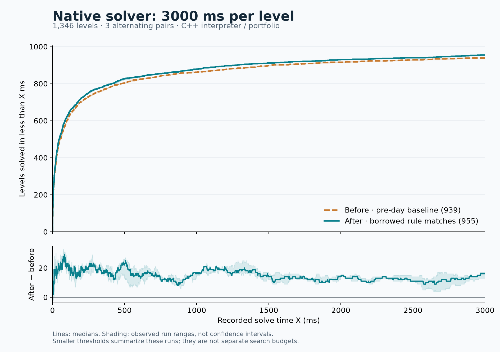

# Native tuple-allocation changes: three seconds per level

The improvement persists at three seconds: **939 → 955 of 1,346 levels**, using
the separate before/after medians. The median paired gain is also **16 levels**.
All three pairs improve, by 17, 16, and 13 levels. This remains a modest increase
in solve count, similar in size to the earlier 250 ms result.

This reruns [the same allocation experiment](native-rule-match-allocations-2026-09-06.md).
Both executable hashes and all 184 corpus source hashes match the 250 ms battery.
The baseline is pre-day `528bdf78`; the candidate has PR #13's borrowed captures
and streamed match tuples. No solver executable was rebuilt for this comparison.

## Complete paired results

Native C++ portfolio, interpreter, one worker, 3,000 ms per level. A strict solve
requires `status == solved` and `elapsed_ms < 3000`. Separate smoke warmups precede
three serial pairs with alternating order.

| Pair / order | Strict before → after | Net | Gained / lost | Nominal before → after |
| --- | ---: | ---: | ---: | ---: |
| 1 / before, after | 940 → 957 | +17 | 17 / 0 | 941 → 957 |
| 2 / after, before | 939 → 955 | +16 | 17 / 1 | 939 → 956 |
| 3 / before, after | 939 → 952 | +13 | 13 / 0 | 940 → 952 |

All six runs cover the same **1,346 playable levels**, excluding 1,444 message
entries, with **zero level errors and zero rejected solution replays**.
Nominal counts include successful results recorded at or beyond the cutoff;
those results are excluded from strict counts and the graph at X = 3,000 ms.

The six measured processes take 141.6 minutes in total. Before wall times are
1,435.2, 1,435.3, and 1,442.4 seconds; after wall times are 1,396.6, 1,389.9, and
1,394.8 seconds. Total wall time is dominated by levels that still time out; it
does not measure execution throughput in the way the separate fixed-work test does.

## Overlaid cumulative curves



| Recorded cutoff within these runs | Median before → after | Difference |
| --- | ---: | ---: |
| <10 ms | 265 → 274 | +9 |
| <50 ms | 492 → 511 | +19 |
| <100 ms | 601 → 624 | +23 |
| <250 ms | 731 → 751 | +20 |
| <500 ms | 804 → 827 | +23 |
| <1,000 ms | 862 → 878 | +16 |
| <2,000 ms | 916 → 930 | +14 |
| <3,000 ms | 939 → 955 | +16 |

These cutoffs summarize the three-second runs; they are not independently rerun
search budgets. Lines are medians, and shading shows observed run ranges, not
confidence intervals. The lower line is the difference between displayed medians;
the lower band covers observed paired differences.

Eleven levels miss the strict cutoff in every baseline run and pass it in every
candidate run. None consistently move in the opposite direction. Source indices
are zero-based:

- The Monsterous Autoshove: 9
- The sponge what lights up the seafloor: 15
- a clear view of the sky: 26
- cooperacing: 8
- hedgehog stimulator: 3, 17, 19, 23
- heroes_of_sokoban_2: 27
- kreiseln: 9
- sokogoban: 2

## Controls and evidence

The original Windows x64 / MSVC Release / 64-bit-mask executables are reused,
with no linked generated rule kernels. The harness clears `PUZZLESCRIPT_*`
overrides. No builds or other benchmarks ran alongside the measured batch.
All solutions retain the production solver's player-runtime validation.

The harness's old 20-minute process watchdog was too short for these approximately
24-minute corpus passes. It now has a separate optional `PROCESS_TIMEOUT_MS`
argument, defaulting to two hours **per process**. This does not change the
3,000 ms per-level search budget. The plot summary now includes intermediate
cutoffs through 2,000 ms for longer runs.

- [Full compressed evidence](benchmarks/2026-09-07-native-tuples-3000ms-evidence.json.gz):
  manifest, exact raw JSON text and stderr for every measured run and warmup.
  The raw text preserves the manifest's output hashes for verification.
- [Per-level results CSV](benchmarks/2026-09-07-native-tuples-3000ms.csv)
- [Threshold and consistent-outcome summary](benchmarks/2026-09-07-native-tuples-3000ms.json)
- [Vector graph](benchmarks/2026-09-07-native-tuples-3000ms.svg)

```text
node src/tests/compare_native_solver_corpus.js BEFORE_SOLVER AFTER_SOLVER src/tests/solver_tests OUTPUT_DIR 3 3000
python src/tests/plot_native_solver_comparison.py OUTPUT_DIR OUTPUT_PREFIX
```

The graph needs NumPy and Matplotlib. This is still an isolated comparison against
the pre-day search baseline, not a measurement of every subsequent solver change
combined with the allocation patch.
