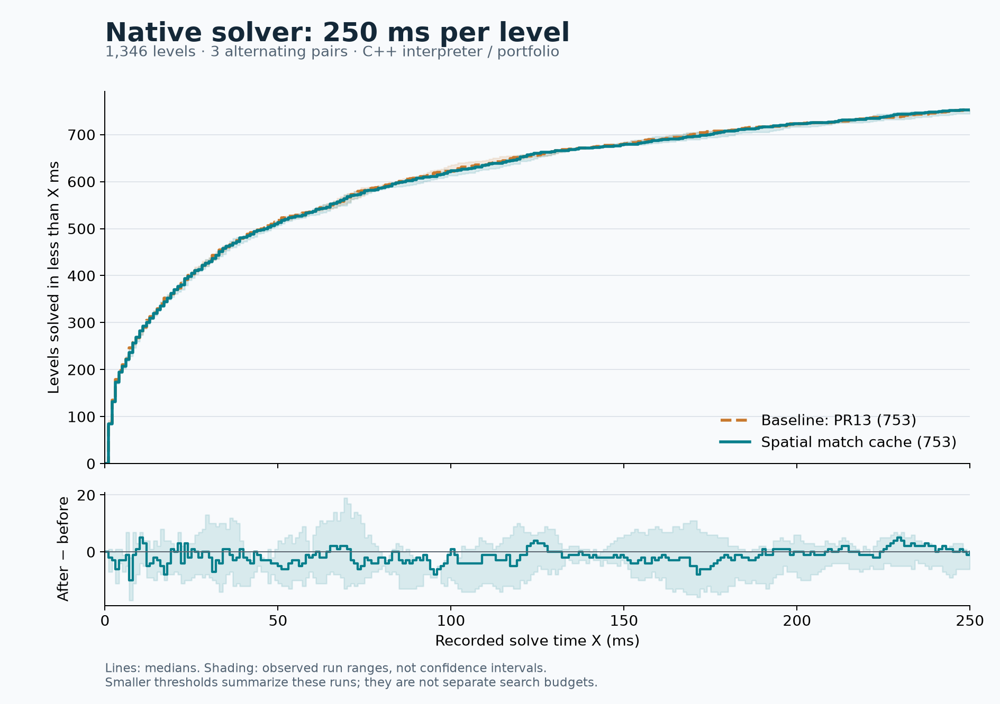

# Spatial match cache: no solve-count gain at 250 ms

The spatial cache does **not** improve this deadline battery. Across three alternating full-corpus pairs, strict solves change by **−1, −6, and 0**. Both sides have a median of **753/1,346**, but the median paired change is **−1**. There are no consistent gains and one consistent loss. The fixed-work throughput gain is not sufficient evidence to enable the feature; keep PR #14 experimental and disabled by default.

| Pair | PR #13 baseline, <250 ms | Spatial cache, <250 ms | Net | Gained / lost |
|---|---:|---:|---:|---:|
| 1 | 754 | 753 | −1 | 6 / 7 |
| 2 | 752 | 746 | −6 | 6 / 12 |
| 3 | 753 | 753 | 0 | 6 / 6 |

All six runs contain the same 1,346 playable levels from 184 games, with zero level errors and zero replay rejections. “Strict” means `status == solved && elapsed_ms < 250`. The solver can report a nominal win slightly after its deadline; those wins are deliberately excluded. Nominal totals are 755→756, 754→748, and 753→754 and do not change the conclusion.

`paint everything everywhere.txt`, source level index **29** (zero-based), passes in all three baseline observations (213, 214, 230 ms) and fails the strict cutoff in all three candidate observations (wins at 251 and 258 ms, then a timeout at 250 ms). No level fails all baseline observations and passes all candidate observations. Individual paired gains/losses fluctuate; three pairs are not a precise estimate of long-run performance.



| Recorded threshold | Median baseline → cache |
|---|---:|
| <10 ms | 277 → 282 |
| <50 ms | 518 → 513 |
| <100 ms | 622 → 623 |
| <250 ms | 753 → 753 |

Smaller thresholds summarize recorded times within the 250 ms runs; they are not separate searches at those budgets. Lines show medians and shading shows observed run ranges, not confidence intervals. The lower line subtracts the two displayed medians; its band covers the paired differences. The curves overlap closely throughout the tested range.

## Controls and interpretation

Baseline: `7a6cabb7`, the allocation-improved PR #13 runtime. Its executable hash is verified against the **candidate** of the earlier tuple-allocation battery. This is not another comparison with the pre-day engine. Candidate: `ea9c56f2`, with `PS_SPATIAL_MATCH_CACHE=ON` and `PS_SPATIAL_MATCH_VERIFY=OFF`. Both use the same unchanged native solver source, MSVC Release x64, 64-bit masks, and no attached generated kernels.

The production native portfolio runs with one worker and 250 ms per level. Order is baseline/candidate, candidate/baseline, baseline/candidate, following smoke warmups. No competing builds or benchmarks ran during the battery. The harness clears `PUZZLESCRIPT_*` overrides and verifies identical corpus keys. Total measured batch wall time is 18.39 minutes; each run took 183–186 seconds.

The previous 5.6–9.5% improvement measured whole-process work under a 100-expansion BFS cap. This experiment measures solves under a wall deadline using the production portfolio. Faster execution on selected expensive games can reduce fixed-work time without moving additional levels across this deadline; this is a possible explanation, not a causal attribution established by these measurements. The corpus result, including the consistent loss, takes priority over the more encouraging throughput metric for this acceptance criterion.

No runtime code changes were made for the deadline test. Keep the option off and retain the evidence. A materially improved candidate, rather than another run of the same implementation, is needed before expecting a different acceptance result.

## Evidence and reproduction

- [Exact raw results, stderr, manifest, and hashes](benchmarks/2026-09-07-spatial-250ms-evidence.json.gz)
- [Per-level recorded times](benchmarks/2026-09-07-spatial-250ms.csv)
- [Threshold summary and consistent changes](benchmarks/2026-09-07-spatial-250ms.json)
- [Vector graph](benchmarks/2026-09-07-spatial-250ms.svg)
- [Prototype design and fixed-work measurements](native-spatial-match-cache-2026-09-07.md)

```text
node src/tests/compare_native_solver_corpus.js PR13_SOLVER SPATIAL_SOLVER src/tests/solver_tests build/spatial-250ms 3 250
python src/tests/plot_native_solver_comparison.py build/spatial-250ms docs/benchmarks/2026-09-07-spatial-250ms "Baseline: PR13" "Spatial match cache"
```

The plot helper now accepts optional legend labels so this experiment cannot be mislabeled as the earlier pre-day/tuple-allocation comparison. Default labels remain compatible with the earlier reproduction commands. The exported graph was visually checked, and archive round-trip checks verify every raw output against its manifest SHA-256.
