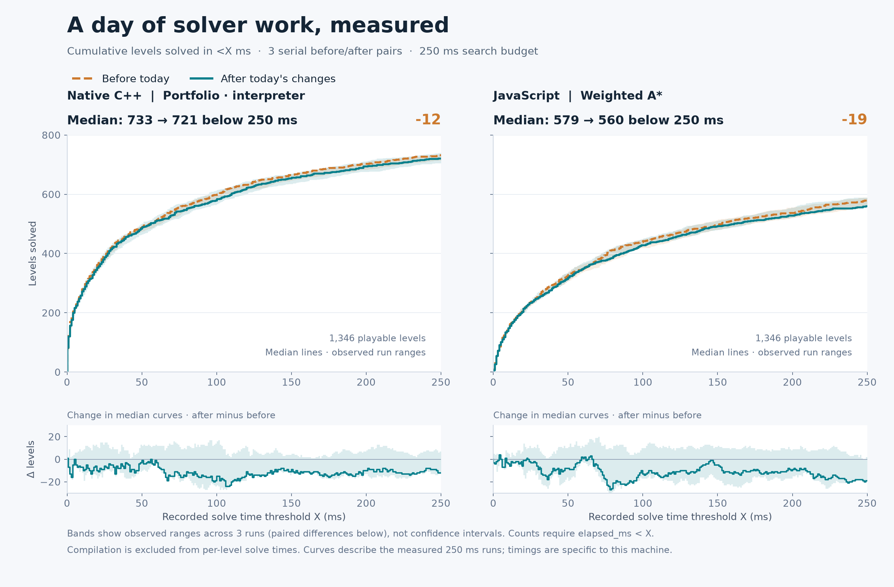

# Whole-day solver battery: 250 ms per level

This battery **does not establish a corpus-wide solve-count improvement** from
today's changes. Separate before/after medians are lower for both implementations,
but the paired results are mixed and run-to-run variation is substantial. Do not
turn these medians into a claim of a stable 12- or 19-level regression either.

Compare **`528bdf78`**, before today's first changes, with **`a12a20c1`**, after
the input-flow refinement. This includes the earlier work merged through PRs
#10 and #11 as well as the current PR. All **184 source files / 1,346 playable
levels** are byte-identical between versions. Related source versions remain
separate entries, matching the existing battery.

## Actual paired results

Count a level only when its result is `solved` and its recorded `elapsed_ms` is
**strictly less than 250**. Each row is a complete corpus run; message levels are
excluded. Three before/after pairs run serially with alternating order.

| Implementation | Pair 1, before → after | Pair 2, before → after | Pair 3, before → after | Separate medians, before → after |
| --- | ---: | ---: | ---: | ---: |
| Native C++, portfolio / interpreter | 714 → 705 | 734 → 721 | 733 → 740 | **733 → 721** |
| JavaScript, weighted A* | 557 → 559 | 579 → 560 | 589 → 589 | **579 → 560** |

Native paired changes are **−9, −13, +7**; JS changes are **+2, −19, 0**.
The difference of separate medians is −12 native / −19 JS, while the median
paired change is −9 native / 0 JS. Those are different summaries of these small,
variable samples. The complete pairs are essential to interpretation.



Orange dashed lines show before; teal solid lines show after. Each main line is
the median cumulative count across three runs; shading is the observed minimum
and maximum. Lower panels show the difference between the displayed median
curves, with the observed range of paired differences. Bands are **not confidence
intervals**. Both panels share a zero-based count axis; the corpus denominator is
1,346 even though the plotted counts remain below 800.

| Recorded threshold | Native before → after, median | JS before → after, median |
| --- | ---: | ---: |
| <10 ms | 266 → 259 | 141 → 138 |
| <50 ms | 487 → 484 | 323 → 315 |
| <100 ms | 598 → 579 | 439 → 429 |
| <250 ms | 733 → 721 | 579 → 560 |

These are cumulative solve times **within the measured 250 ms runs**, not
separate runs at every smaller budget. A budget-dependent search policy need not
follow the same path when rerun with a different deadline.

## Levels gained and lost

| Implementation / pair | Gained at the strict cutoff | Lost at the strict cutoff | Net |
| --- | ---: | ---: | ---: |
| Native 1 | 6 | 15 | −9 |
| Native 2 | 4 | 17 | −13 |
| Native 3 | 9 | 2 | +7 |
| JS 1 | 11 | 9 | +2 |
| JS 2 | 1 | 20 | −19 |
| JS 3 | 3 | 3 | 0 |

There are 38 native and 42 JS levels with at least one changed paired outcome.
The [changed-level CSV](benchmarks/2026-09-06-day-250ms-changed-levels.csv) includes
cases that retain the same overall solve frequency but flip between pairs.

Only one level is lost in every observation: **native `gapfiller.txt`, source
level index 3 (zero-based)**. Before: solved in 221, 219 and 220 ms. After:
timeouts recorded at 251, 250 and 250 ms. This is a concrete investigation target,
not proof of a semantic failure. No level in either implementation goes from
unsolved in all three baseline observations to solved in all three current
observations. JS has no corresponding all-three-runs loss.

## Strict times versus nominal search budgets

A timeout is checked between operations. A final expensive operation or replay
can finish after the nominal deadline and still return a solved result. The
existing battery's solved totals therefore differ slightly from strict `<250 ms`
counts. These late results remain archived, but do not enter the graphs.

| Implementation | Before, solved under nominal budget | After, solved under nominal budget | Before / after medians |
| --- | --- | --- | --- |
| Native | 717, 736, 735 | 706, 725, 742 | 735 → 725 |
| JS | 557, 581, 593 | 561, 564, 591 | 581 → 564 |

For example, the first native baseline reports a `car crash.txt` solution at
345 ms. It is a solved result, but it does not satisfy the user's strict cutoff.

## Controls and limits

- Windows x64, MSVC 19.44.35207.1, Release `/MD /O2 /Ob2 /DNDEBUG`, 64-bit mask
  words. Both native executables were freshly built with matching settings and
  no linked generated kernels. Runtime attachment fields confirm that scope.
- JS runs each revision's own solver, compiler and engine using the same Node
  executable. Both use the battery's weighted-A* default and `auto` heuristic;
  native uses its standard portfolio. Compare before/after **within each panel**,
  rather than attributing the cross-panel difference solely to language speed.
- One worker, fixed corpus order within each runner, normal runner defaults.
  Inherited `PUZZLESCRIPT_*` overrides are cleared. No opt-in future-object
  pruning, hash projection, certified wake pruning or push-space search is enabled.
- Separate smoke warmups check both executables and both JS trees before the
  measured runs. Each measured run is a fresh process; these are not persistent
  JIT-warmed sessions. All twelve runs complete; no adverse observation is dropped.
- Execution order: native before/after then JS before/after for pair 1; JS
  after/before then native after/before for pair 2; native before/after then JS
  before/after for pair 3. No builds, plotting or heavy tests run concurrently.
- Per-level times exclude source compilation. Native's recorded time includes
  level setup and normal-runtime solution replay; JS normally measures its
  search phase, with a separate startup-win path. These existing timing
  conventions are retained in both revisions. Whole-process wall times are also
  archived: **41.50 minutes** across the twelve measured passes.
- All runs cover the same level keys within each implementation, with zero
  compiler/solver errors and zero reported JS replay rejections. Result hashes
  are verified before aggregation, and timed-source hashes still match afterward.
- This is a single-machine, three-pair observation. The run ranges are wide,
  and the cause of that variation has not been isolated. Neither stable speedup
  nor a precise universal regression follows from these data.

The earlier Robot Arm fixed-work and candidate-evaluation gains remain separate
measurements. This battery directly answers how many corpus levels the default
standalone solvers finish at the requested cutoff. It does not exercise generator
cache reuse or keeper assessment throughput, and it does not demonstrate a
whole-corpus solver acceptance win for today's package.

## Artifacts and reproduction

- [PNG chart](benchmarks/2026-09-06-day-250ms-curves.png),
  [SVG chart](benchmarks/2026-09-06-day-250ms-curves.svg),
  [PDF chart](benchmarks/2026-09-06-day-250ms-curves.pdf).
- [Cumulative counts CSV](benchmarks/2026-09-06-day-250ms-curves.csv),
  [summary and per-pair gains/losses](benchmarks/2026-09-06-day-250ms-summary.json),
  [changed-level CSV](benchmarks/2026-09-06-day-250ms-changed-levels.csv).
- [Complete compressed observations](benchmarks/2026-09-06-day-250ms-raw.json.gz):
  manifest, commands, revisions, source/binary hashes, warmups, all per-level
  counters, times and complete solutions. Parsed JSON is compressed losslessly;
  original output-file hashes are retained in the manifest.

Export the before revision's `native`, `src`, `firmware/gbc`, and package metadata
into an isolated directory. Build `puzzlescript_solver` from each revision's
`native/` directory with matching Release settings and no generated sources.
Then run, from the current repository root:

```text
node src/tests/compare_solver_corpus.js BEFORE_ROOT AFTER_ROOT BEFORE_NATIVE AFTER_NATIVE OUTPUT_DIR 3 250
node src/tests/summarize_solver_corpus.js OUTPUT_DIR REPORT_PREFIX
python src/tests/plot_solver_corpus.py OUTPUT_DIR CHART_PREFIX
```

The comparator validates identical corpus source hashes, preserves each
revision's own runner and captures every completed observation. The plotter uses
Matplotlib and NumPy; this chart was rendered with Matplotlib 3.11.1 and NumPy
2.4.6. Re-running a fixed-budget battery will not reproduce exact counts; that
variation is why the complete paired observations and ranges are retained.
