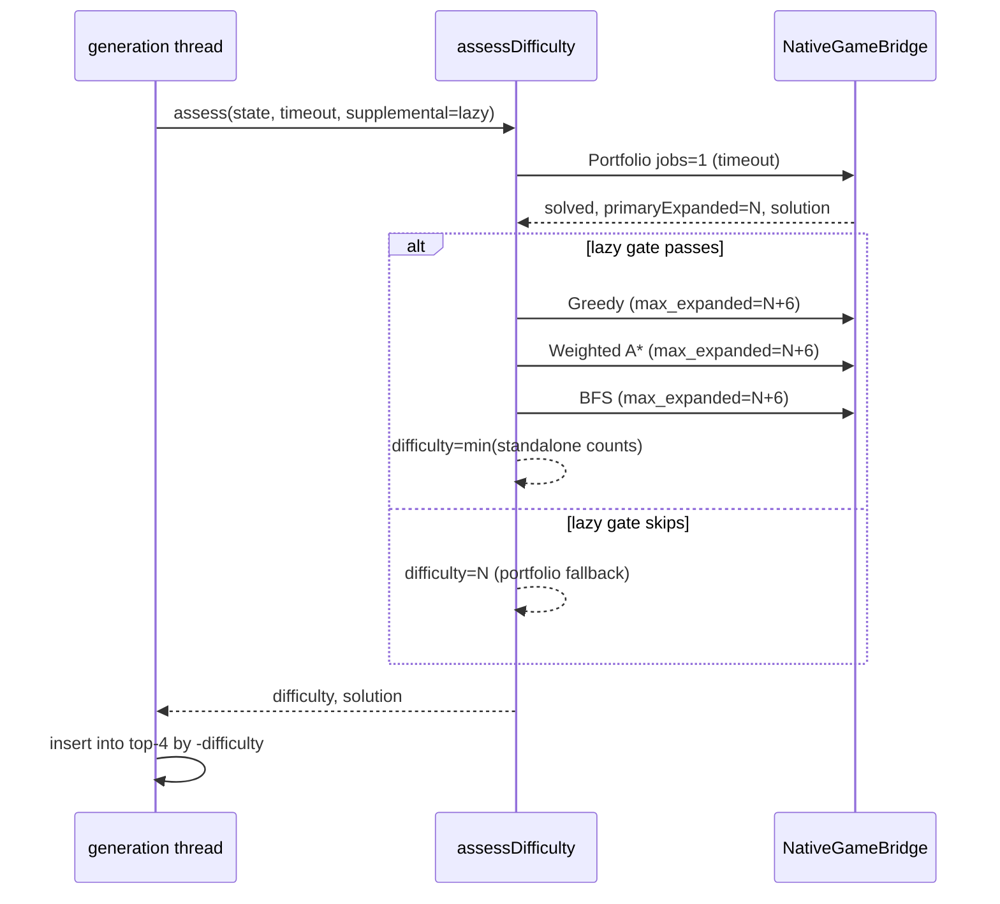

# PuzzleScript+MIS Multi-Difficulty Assessment Design

## Summary

Restore the original PuzzleScript+MIS difficulty metric: **states expanded to find a solution**, scored as the minimum across **four** native search lanes — the adaptive **portfolio** plus standalone **Weighted A\***, **Greedy**, and **BFS**.

Use a **two-phase** model on a single worker thread:

1. **Primary (solvability + bound):** adaptive **portfolio** with `portfolio_jobs = 1` — fast interleaved search (wa2/wa3/wa8/greedy/bfs lanes, shared visited set). Its `expanded` count is the first difficulty lane and bounds the refinement work.
2. **Refinement (difficulty):** three dedicated standalone strategy calls with `max_expanded = primaryExpanded + 6` to produce honest per-strategy counts.

Final `difficulty = min(expandedPortfolio, expandedGreedy, expandedWeightedAStar, expandedBfs)` over the lanes that solved. The portfolio lane always solves (it gated entry to refinement), so it also seeds the supplemental cap / throughput estimates and serves as the fallback when every standalone lane hits the cap.

## Goals

- Score difficulty as `min(expandedPortfolio, expandedGreedy, expandedWeightedAStar, expandedBfs)` over the lanes that solved (portfolio bound + standalone trio when supplemental refinement runs).
- Level UI: show per-strategy expanded counts (like pre-native MIS) plus headline min.
- Generation: rank curated candidates by refined min when supplemental runs; otherwise fall back to portfolio `expanded` for ranking.
- Primary solve: `PS_SOLVE_STRATEGY_PORTFOLIO` with `portfolio_jobs = 1` (adaptive single-thread portfolio — keep current MIS primary behavior).
- Supplemental refinement: lazy in generation (thesis-style); always in level UI.
- Single-thread orchestration: one `CandidateSolverContext` runs primary then supplementals back-to-back.

## Non-Goals

- Using portfolio aggregate `expanded` as the *sole* difficulty metric — it is the bounding lane in the four-way min, not a standalone score.
- Parallel supplemental solvers or `portfolio_jobs > 1` inside MIS workers.
- `weighted-astar-deep` or HDA as difficulty lanes.
- Changing transformation language or curation count (still top 4).
- Reintroducing old interpreted C++ solvers in `tools/puzzlescriptmis-app/src/solver.cpp`.

## Why portfolio primary + standalone supplemental

| Concern | Portfolio (jobs=1) | Standalone WA\* |
|---|---|---|
| Find solution under timeout | **Better** — interleaves greedy/BFS/weighted lanes | Single lane only |
| Per-strategy expanded count | **No** — one shared `expanded` total (the bounding lane) | **Yes** |
| Contributes a lane to `min(...)` | **Yes** — as the portfolio bound | **Yes** (one strategy per run) |

Primary job is solvability; refinement job is measurement. Same split as old MIS (one solver first, then capped double-checks), except primary is portfolio instead of `bestSolver()`.

## Architecture

### Native layer

Add optional **`max_expanded`** to `ps_solve_options` (0 = unlimited). In `runSearch`, stop when `result.expanded >= max_expanded` before expanding the next node, returning `PS_SOLVE_STATUS_TIMEOUT` with partial `expanded`. Supplemental standalone runs use `max_expanded = primaryExpanded + 6` (old MIS memoization cap).

Standalone strategy priorities (unchanged):

| Strategy | Priority |
|---|---|
| BFS | depth |
| Greedy | heuristic |
| Weighted A\* | depth + weight × heuristic |

### MIS bridge layer

New shared helper: `tools/puzzlescriptmis-app/src/native_bridge/DifficultyAssessment.{h,cpp}`

```cpp
struct DifficultyBreakdown {
    long long expandedPortfolio = -1;    // portfolio bound (first lane)
    long long expandedWeightedAStar = -1;
    long long expandedGreedy = -1;
    long long expandedBfs = -1;
    long long difficulty = -1;       // min over the lanes that solved
    std::string difficultyAlgorithm; // "Portfolio" | "WeightedAStar" | "Greedy" | "BFS"
};

struct DifficultyAssessmentOptions {
    long long primaryTimeoutMs = 500;
    bool runSupplemental = true;
    long long supplementalCap = -1;  // if >= 0, max_expanded for standalone trio
};

struct DifficultyAssessmentResult {
    CandidateSolveStatus primaryStatus;
    long long primaryExpanded = 0;   // portfolio total — the first difficulty lane (breakdown.expandedPortfolio)
    std::string primaryStrategy;     // e.g. "portfolio:greedy"
    std::vector<short> solution;     // from portfolio primary
    DifficultyBreakdown breakdown;
    bool supplementalRan = false;
};
```

`assessDifficulty(context, state, options)`:

1. Run **portfolio** (`PS_SOLVE_STRATEGY_PORTFOLIO`, `portfolio_jobs = 1`), wall-clock timeout, no expansion cap.
2. If not solved → return; no supplemental.
3. Record `primaryExpanded`, `primaryStrategy`, portfolio solution. Seed `breakdown.expandedPortfolio = primaryExpanded` and `difficulty = primaryExpanded` ("Portfolio").
4. If `!runSupplemental` → return with the portfolio-only breakdown (lazy generation skip).
5. `cap = options.supplementalCap >= 0 ? options.supplementalCap : (primaryExpanded + 6)`.
6. Run standalone **Greedy**, **Weighted A\***, **BFS** (in any order) each with `max_expanded = cap` and generous wall-clock timeout.
7. For each supplemental run that **solves** within cap, record its `expanded` in breakdown.
8. `difficulty = min(expandedPortfolio, <each standalone lane that solved>)`; `difficultyAlgorithm` is the argmin lane. The portfolio lane always counts, so it is the natural fallback when every standalone lane hits the cap.

Plumb `ps_solve_strategy` and `max_expanded` through `NativeGameBridge::solveLayerGrid(grid, timeoutMs, strategy, maxExpanded)`.

### Level UI (`levelSolve` + `visualsandide`)

Extend `levelSolve::Snapshot`:

```cpp
enum class Phase { Idle, Running, Refining, Solved, Unsolvable };

struct Snapshot {
    Phase phase;
    int solutionLength;
    long long difficulty;              // min (-1 if unknown)
    long long expandedPortfolio;       // portfolio bound (first lane)
    long long expandedGreedy;          // -1 until standalone run completes
    long long expandedWeightedAStar;
    long long expandedBfs;
    string difficultyAlgorithm;
    string algorithm;                  // primary portfolio lane label
    uint64_t stateHash;
};
```

Phases:

1. **Running** — portfolio with doubling timeout until solved / unsolvable / stopped.
2. **Refining** — standalone Greedy, WA\*, BFS (always after portfolio solve).
3. **Solved** — final breakdown + min.

Display (right side), lowest (winning) lane highlighted:

```text
Diff 2048Prt 1234Grd 5678WA* 9012BFS
```

Use `?` for counts not yet computed. Left side shows `Solution size: <n>` from the portfolio primary path. We do **not** claim it is shortest — the portfolio can return a non-optimal path even when the BFS lane confirms a shorter optimum exists, and the BFS lane's own path is not currently carried back.

### Generation (`generation.cpp`)

Replace bare `solveGeneratedState` scoring with `assessDifficulty`:

- **Primary:** portfolio under `timeToSolve` (keep throughput-based budget growth from primary `expanded` + elapsed).
- **Lazy supplemental gate:** after portfolio solves, run standalone trio only if:
  - `generatorNeighborhood[level].size() < 4`, **or**
  - `primaryExpanded >= fourthPlace` difficulty (may use stored refined min from neighborhood entries when available; otherwise compare against `-rbegin()->first` as today).
- **Rank:** use `breakdown.difficulty` when `supplementalRan`; else `primaryExpanded`.
- Timeout retry stack and counters unchanged except scoring field.

## Data Flow



## Error Handling

- Primary portfolio error → timeout/error for generation; error in level UI.
- Supplemental timeout without solve within cap → lane stays `-1`; does not lower min.
- Unsolvable primary → skip supplemental; `Unsolvable`.
- All supplementals fail within cap → only the portfolio lane is populated, so the four-way `min` falls back to `difficulty = expandedPortfolio`.

## Testing

1. Native: `max_expanded` stops at cap.
2. Bridge: strategy parameter; portfolio primary still returns `portfolio:*` strategy label.
3. Bridge: `assessDifficulty` with supplemental populates the portfolio lane plus three standalone counts and correct min.
4. Generation: refined candidate ranks by min when supplemental runs.
5. Smoke + MIS app build.

## Relation to Prior Work

**Extends** `2026-06-20-puzzlescriptmis-portfolio-solver-design.md`: keep portfolio primary for generated/level solvability; **add** standalone trio for difficulty measurement. Does not replace portfolio with standalone WA\* for primary search.

## Approved Decisions

- **Orchestration:** Sequential calls — portfolio primary, then standalone trio.
- **Primary solve:** Adaptive portfolio (`portfolio_jobs = 1`).
- **Difficulty metric:** `min` over the lanes that solved — portfolio bound + standalone Greedy / Weighted A\* / BFS expanded counts.
- **Generation supplemental gating:** Lazy — only when portfolio solve might affect top-4.
- **Level UI supplemental:** Always run standalone trio after portfolio solve.
- **State cap:** Native `max_expanded` on supplemental runs (`primaryExpanded + 6`).
