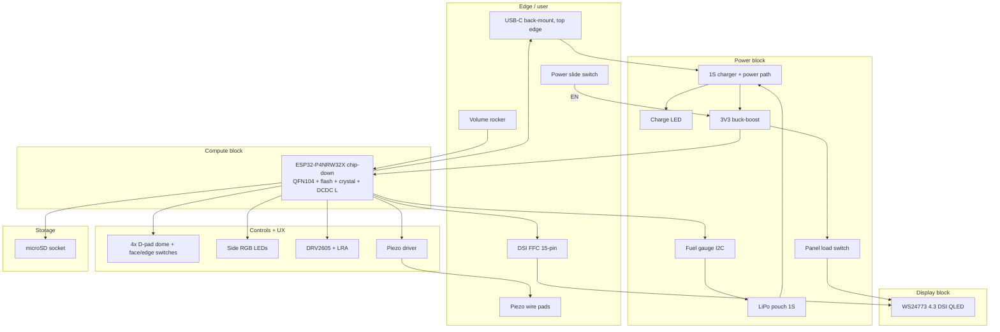

# PuzzleScript Card — block diagram

Status: PCB reset baseline (2026-07-08). Custom **116 x 106 mm** two-sided
PCB; not a dev-kit carrier. Mechanical anchors: `mechanical/layout.json`.
The reset baseline uses **one large rear 1S pouch**, low and centered, with the
ESP32-P4 chip-down cluster above it and the power cluster near the pouch tabs. See
`docs/superpowers/specs/2026-07-08-handheld-card-reset-design.md`.

## System overview



## Power tree

```
USB-C VBUS (5 V) ──┬──► Charger IC (e.g. BQ24075-class; CHG pin ──► charge LED from VBUS)
                   │         │
1S LiPo (3.0–4.2 V)┘         ├──► SYS rail (~3.3–5 V switched)
                             │         │
                             │         ├──► 3V3 buck-boost (~1 A cont., >=500 mA display headroom)
                             │         │         ├──► ESP32-P4 chip + flash + crystal (ESP_EN = pull-up + test pad)
                             │         │         ├──► Logic, I2C, SD, LEDs, piezo driver
                             │         │         └──► Panel load switch ──► +3V3_PANEL (FFC pin 14 + local bulk)
                             │         │
                             │         └──► (optional) charge-path load when USB present
                             │
                             └──► Fuel gauge sense (I2C, cell voltage/current)

Power slide switch (SPDT) ──► buck-boost EN (ON = SYS, OFF = GND; hard off).
No latch IC; charger SYSOFF tied inactive. Charging works with the switch off.
```

Budget (from spec, owner-confirmed):

| Rail | Budget | Notes |
|------|--------|-------|
| Panel 3V3 | ~400 mA peak | Backlight on display assembly; no boost on card |
| P4 chip | ~200 mA avg bursts | Compile/redraw peaks higher, short duty |
| Rest | &lt;50 mA | SD, I2C, haptics, LEDs |

## Block inventory (reset baseline)

| ID | Block | Function | Candidate parts (JLC-friendly) |
|----|-------|----------|--------------------------------|
| **U1** | Compute | ESP32-P4, 32 MB in-package PSRAM, no radio | **ESP32-P4NRW32X** chip-down (QFN104 10×10, 0.9 mm) |
| **U9/X1/L1** | Compute support | 32 MB QSPI NOR flash, 40 MHz crystal, DC-DC inductor | Per Espressif chip-down reference design |
| **U2** | Charger | 1S linear charger, power path, SYSOFF | TI BQ24075 baseline |
| **U3** | Fuel gauge | SOC %, alert | MAX17048 / CW2015 |
| **U4** | Buck-boost | Regulated 3V3 from 1S LiPo | TI TPS63070 baseline / TPS63802 alternate |
| **U6** | Panel load switch | Gate display 3V3 in sleep | TPS22918 / TPS22919 class |
| **D4/R8** | Charge LED | Charging indicator, works with power off | 0603 LED from VBUS via charger CHG pin |
| **J1** | USB-C | On PCB back at top edge (rear shell bump), USB 2.0, 5 V charge | HRO TYPE-C-31-M-12 class (JLC basic) |
| **J2** | Battery | One rear 1S pouch, low/centered; pads or low-profile connector after cell choice | 403048-class baseline; 503048/603048 only with rear recess/thicker band |
| **J3** | DSI FFC | 15-pin 1.0 mm, top edge | Molex 505110-1510 class |
| **J4** | microSD | Push-push, internal | — |
| **U5** | Haptic | I2C LRA driver | DRV2605L |
| **Q1/U8/R7** | Piezo | Simple transistor drive plus DNP boost/H-bridge escape path | SOT23 BJT + DNP driver + 0R return link |
| **SW1-SW4** | D-pad | Four separate direction buttons | TL3315NF160Q-class 4.5 x 4.5 x 1.2 mm dome tact |
| **SW5-SW8** | Face/Menu | Action/Undo/Restart/Menu | KMR2 baseline, TL3315 face-button check pending |
| **SW9** | Power switch | Top-edge slide, gates buck-boost EN (hard off) | C&K JS102000SAQN / ALPS SSSS8 class SPDT slide |
| **SW10** | Volume | Right-edge rocker legs | Panasonic EVP-AKE31A class |
| **D*** | RGB | Side-firing into shell | 3× 3227 or 2835 side LED |

## Signal priorities (layout order)

1. **MIPI DSI** — 100 Ω diff, length-matched, short, 4-layer reference plane.
2. **USB D+/D−** — 90 Ω diff, direct chip USB PHY pins to USB-C.
3. **3V3 high-current** — wide pours to FFC + chip cluster; bulk caps at FFC, chip, buck-boost.
4. **I2C** — fuel gauge + DRV2605 on one bus, pull-ups near the chip.
5. **Everything else** — GPIO switches, SD, piezo, RGB.

## Compute choice (revised 2026-07-09: chip-down)

**ESP32-P4NRW32X soldered directly to the card PCB.** The Waveshare module
(25 × 25 × 3.3 mm) is retired: its height broke the 9.5 mm display-zone
Z-stack, and its pre-certified C6 radio would ship dark (owner confirmed no
WiFi for this board generation). See
`docs/superpowers/specs/2026-07-09-handheld-card-chip-down-design.md`.

- QFN104, 10 × 10 mm, 0.35 mm pitch, 0.9 mm tall — display-zone stack closes
  at ~8.2 mm with margin.
- We own the support circuitry: QSPI NOR flash, 40 MHz crystal, internal
  DC-DC inductor/feedback, straps — copied from the Espressif reference
  design (their dev boards are chip-down with public schematics).
- No radio, no antenna, no RF keep-out. Wireless would require a new spin in
  any case.
- BOM must spec the **X** revision (v3.x silicon); the plain NRW32 is
  EOL/NRND.

## Debug / test (back of PCB)

Test pads (no connector in v1): UART TX/RX, EN, BOOT, 3V3, GND, optional JTAG
on the P4 debug pins per firmware needs. Chip-down bring-up adds crystal,
flash-boot, and DC-DC rail checks before any peripheral work.

## Related files

- `PIN_BUDGET.md` — nets, GPIO map, connector pinouts
- `docs/superpowers/specs/2026-07-09-handheld-card-power-switch-design.md` — power slide switch decision (U7 latch removed)
- `schematic/blocks.json` — machine-readable block list for schematic-as-code
- `docs/superpowers/notes/2026-07-08-handheld-card-pcb-handoff.md` — BOM notes
