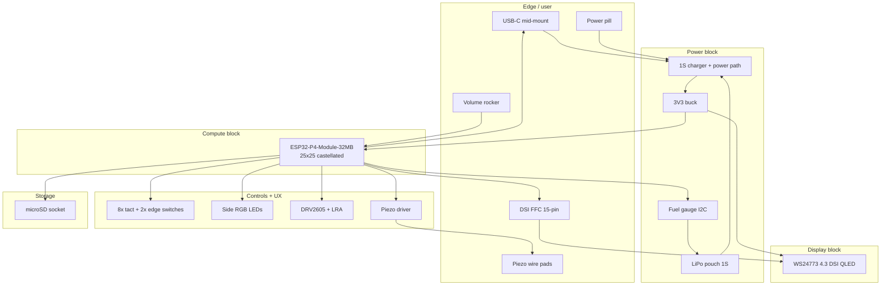

# PuzzleScript Card — block diagram

Status: spin 1 architecture (2026-07-08). Custom **116 × 106 mm** PCB; not a dev-kit
carrier. Mechanical anchors: `mechanical/layout.json`.

## System overview



## Power tree

```
USB-C VBUS (5 V) ──┬──► Charger IC (e.g. BQ24075-class)
                   │         │
1S LiPo (3.0–4.2 V)┘         ├──► SYS rail (~3.3–5 V switched)
                             │         │
                             │         ├──► 3V3 buck (~1 A cont., ≥500 mA display headroom)
                             │         │         ├──► ESP32-P4-Module (ESP_3V3 ×2, ESP_EN)
                             │         │         ├──► Logic, I2C, SD, LEDs, piezo driver
                             │         │         └──► Panel 3V3 (FFC pin 14 + local bulk)
                             │         │
                             │         └──► (optional) charge-path load when USB present
                             │
                             └──► Fuel gauge sense (I2C, cell voltage/current)
```

Budget (from spec, owner-confirmed):

| Rail | Budget | Notes |
|------|--------|-------|
| Panel 3V3 | ~400 mA peak | Backlight on module; no boost on card |
| P4 module | ~200 mA avg bursts | Compile/redraw peaks higher, short duty |
| Rest | &lt;50 mA | SD, I2C, haptics, LEDs |

## Block inventory (spin 1)

| ID | Block | Function | Candidate parts (JLC-friendly) |
|----|-------|----------|--------------------------------|
| **U1** | Compute | P4 + C6 WiFi, 32 MB flash, 32 MB PSRAM | **Waveshare ESP32-P4-Module-32MB** |
| **U2** | Charger | 1S linear/switch charger, power path, ship mode | TI BQ24075 or BQ25895-class |
| **U3** | Fuel gauge | SOC %, alert | MAX17048 / CW2015 |
| **U4** | Buck | 3V3 @ ≥1 A | TI TPS62135 / MP2359 / SY8089 |
| **J1** | USB-C | Mid-mount, USB 2.0, 5 V charge | CUI / Korean Hrop 16-pin mid-mount |
| **J2** | Battery | 2-pin JST-PH or pouch tabs | — |
| **J3** | DSI FFC | 15-pin 1.0 mm, top edge | Molex 505110-1510 class |
| **J4** | microSD | Push-push, internal | — |
| **U5** | Haptic | I2C LRA driver | DRV2605L |
| **Q1–Q2** | Piezo | Push-pull or half-bridge | SOT23 BJT + passives |
| **SW*** | Switches | 4× D-pad + Action/Undo/Restart/Menu + edge | 4.3×4.3×2.5 mm tact |
| **D*** | RGB | Side-firing into shell | 3× 3227 or 2835 side LED |

## Signal priorities (layout order)

1. **MIPI DSI** — 100 Ω diff, length-matched, short, 4-layer reference plane.
2. **USB D+/D−** — 90 Ω diff, direct module USB pins to USB-C.
3. **3V3 high-current** — wide pours to FFC + module; bulk caps at FFC, module, buck.
4. **I2C** — fuel gauge + DRV2605 on one bus, pull-ups near module.
5. **Everything else** — GPIO switches, SD, piezo, RGB.

## Compute choice (locked spin 1)

**ESP32-P4-Module-32MB** (Waveshare), not chip-down, not a NANO dev board.

- 25 × 25 mm, 1 mm castellated edge — reflow onto card PCB.
- DSI lanes broken out on module pins 34–39 — route to FFC only.
- USB HS on pins 48–49 — route to USB-C.
- WiFi via C6 co-processor (not required for v1 gameplay; antenna keep-out on back).

Chip-down ESP32-P4NRW32 remains a spin-2 slimming option if Z-stack demands it.

## Debug / test (back of PCB)

Test pads (no connector in v1): UART TX/RX, EN, BOOT, 3V3, GND, optional JTAG strapped
to module C6 or P4 debug pins per firmware needs.

## Related files

- `PIN_BUDGET.md` — nets, GPIO map, connector pinouts
- `schematic/blocks.json` — machine-readable block list for schematic-as-code
- `docs/superpowers/notes/2026-07-08-handheld-card-pcb-handoff.md` — BOM notes
