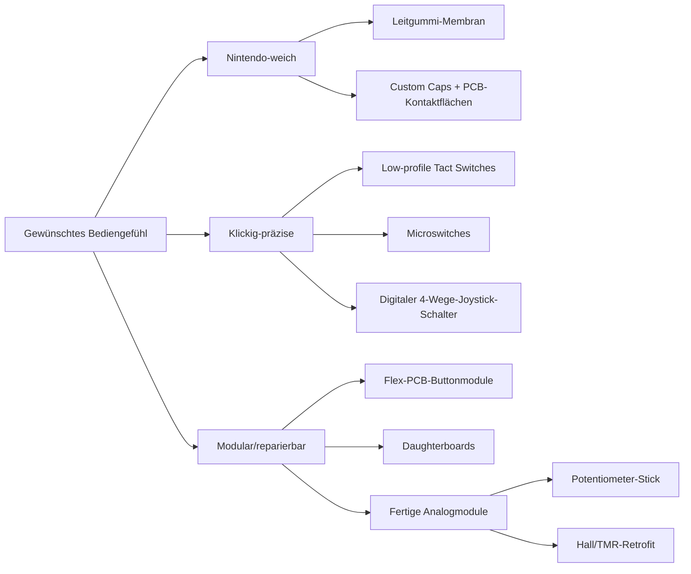

# Tiefenrecherche zum Aufbau einer Handheld-Spielkonsole von Grund auf

## Zusammenfassung

Für einen selbst entwickelten Handheld gibt es heute im Wesentlichen drei tragfähige Eingabe-Architekturen. Erstens die **Nintendo-artige Leitgummi-Membran auf PCB-Kontakten**: Sie bleibt der Referenzpunkt für ein weiches, leises, langstrecken-taugliches D-Pad und weiche Face-Buttons. Man sieht sie in klassischen Nintendo-Handhelds, in modernen Reparaturteilen für das Steam Deck und in ODROID/Retro-Handheld-Kits. Zweitens die **taktile PCB-Lösung**: Sie wird von Makern und Moddern eingesetzt, wenn ein klickigeres Feedback, eine einfachere COTS-Beschaffung und reproduzierbare Elektrik wichtiger sind als das OEM-Gefühl. Drittens die **Subassembly-Lösung** aus Flex-Kabeln, Daughterboards und fertigen Analogmodulen: Sie ist in Industriegeräten wie PSP und Steam Deck gängig und reduziert mechanisches Risiko, erhöht aber Teilezahl und Montageaufwand. citeturn37search2turn39search18turn15search10turn16search12turn36search0

Wenn du ein Gerät im Stil von Game Boy, GBA, DS oder Analogue Pocket bauen willst, ist die wichtigste Designentscheidung nicht zuerst der SoC, sondern das **gewünschte Bediengefühl**. Für „Nintendo-Feel“ ist eine Membranlösung fast immer die bessere Wahl; genau deshalb berichten Reparatur- und Modding-Communities regelmäßig, dass OEM-Membranen oder hochwertige Repros natürlicher wirken als aggressive Tactile-Umbauten oder billige Aftermarket-Membranen. Klickige Umbauten funktionieren, erhöhen aber oft die nötige Kraft und können einen „zweistufigen“ Druckpunkt erzeugen. citeturn40search16turn16search7turn41search13turn36search0

Für ein erstes Prototyping mit öffentlich dokumentierten, gut beschaffbaren Teilen ist die praktikabelste COTS-Kombination heute: **C&K KMR2** oder **Omron B3U** für kleine Top-Buttons, **Panasonic EVP-AK** oder **EVQ-P7** für Volume/Side Buttons, **Omron D2LS** oder **C&K KSC2/KSC4** für Schultertasten und **ALPS RKJXV122400R** für einen kompakten Potentiometer-Thumbstick. Wenn du einen hallbasierten Stick bewusst als Retrofit-Modul statt als eigener Schraubstock-Mechanik verwenden willst, sind **GuliKit-Hall-Module** für Steam Deck/Joy-Con die derzeit sichtbarsten Referenzen – allerdings mit deutlich schwächerer öffentlicher Datensatzlage als bei ALPS, Omron oder Panasonic. citeturn20view2turn20view1turn32search0turn20view0turn20view3turn34view0turn20view4turn29search0turn29search1

Unter den Recherchequellen stechen fünf Klassen hervor: **iFixit** für echte Reparatur- und Teilearchitektur, **Herstellerdatenblätter** für belastbare Mechanik- und Schaltspezifikationen, **Hardkernel/ODROID-Wiki** für offene DXF/Schematics und Kit-Mechanik, **ConsoleMods/GBATemp/BitBuilt** für praktische Modderkenntnisse und **r/SBCGaming / r/Gameboy / r/SteamDeck / r/AnaloguePocket** für aktuelle Erfahrungswerte zu Haptik, QC und Retrofit-Kompatibilität. Für moderne ergonomische Orientierung ist Valves Steam-Deck-Hardwareseite nützlich; für motorische Zugänglichkeit sind Xbox Accessibility Guidelines und Game Accessibility Guidelines wichtiger als jede einzelne Teardown-Seite. citeturn15search0turn39search0turn40search2turn42search1turn40search4turn42search19turn41search2turn41search3turn43search0turn25search1turn25search3

## Annahmen und Vorgehen

Ich nehme für diese Auswertung einen **kompakten Horizontal-Handheld** an: etwa 3,5–5 Zoll Display, zwei Schultertasten, digitale Hauptbedienung, optional ein einzelner Analogstick, 1,6-mm-FR4-PCB und ein Gehäuse aus spritzgegossenem ABS oder 3D-gedrucktem PA12/Resin für frühe Prototypen. Wo ein Gerät historisch eine andere Lösung nutzte – etwa der GBA mit Volume-Slider statt Volume-Tasten –, führe ich das als Referenzfall auf und leite davon moderne Entwurfsentscheidungen ab.

Wichtig ist die Quellengewichtung. **Primärquellen** sind hier Herstellerdatenblätter, offizielle Produkt-/Reparaturseiten und Original-Wikis. **Sekundärquellen** sind originale Teardowns und Reparaturguides. **Community-Quellen** nutze ich vor allem dort, wo es um reale Haptik, QC-Schwankung, Membranqualität und Retrofit-Praxis geht. Wo OEM-Teilenummern nicht öffentlich sind, nenne ich **funktional passende COTS-Äquivalente** statt so zu tun, als sei die genaue OEM-Ursprungsquelle offen dokumentiert.

## Communities und Rechercheorte

Die folgende Liste ist bewusst kuratiert für einen Such-Workflow, nicht bloß als Link-Sammlung. Ich würde sie in genau dieser Reihenfolge durchsuchen: erst Primär-/Teardown-Quellen, dann offene Hardware, dann Communities.

| Typ | Quelle | Wofür sie besonders nützlich ist | Priorität |
|---|---|---|---|
| Original-Teardowns / Reparatur | **iFixit** – Geräte- und Teile-Seiten für Game Boy, GBA, DS Lite, PSP, Steam Deck, Analogue Pocket. citeturn18search1turn16search14turn17search5turn38search6turn15search0turn15search7 | Echte Teilearchitektur: Membranen, Button-Boards, Daughterboards, Schrauben, Demontagereihenfolge. | Sehr hoch |
| Herstellerdatenblätter | Panasonic, Omron, ALPS Alpine, C&K/Littelfuse. citeturn20view0turn20view1turn20view2turn20view3turn20view4turn32search0 | Verlässliche Maße, Kraft, Hub, Lebensdauer, Footprints. | Sehr hoch |
| Offene Handheld-Hardware | **Hardkernel ODROID Wiki** mit Schematics und DXF; **Game Bub** GitHub/Crowd Supply/Discord. citeturn39search0turn19search0turn19search21turn42search4 | Mechanische Referenzen, offene Stücklisten, echte DIY-Baupfade. | Sehr hoch |
| Praxis-Wiki | **ConsoleMods Wiki**. citeturn40search2turn40search6turn40search10 | Reparatur- und Modding-Praxis, vor allem für Game-Boy-Familie und Membranen. | Hoch |
| Forum | **BitBuilt**. citeturn40search4turn40search11 | Portable-Console-Eigenbauten, Custom-PCBs, Gehäuse, Worklogs. | Hoch |
| Forum | **GBATemp Gameboy Modding**. citeturn42search1turn42search17 | Sehr guter Suchort für Nintendo-Handheld-Reparaturen, Ersatzteile und konkrete Modding-Probleme. | Hoch |
| Subreddit | **r/SBCGaming**. citeturn42search19turn41search0turn41search4turn41search20 | Aktuelle DIY-SBC-Handhelds, moderne Analog- und Button-Layouts, Community-Kompatibilität. | Hoch |
| Subreddit | **r/Gameboy**. citeturn41search1turn41search5turn41search9turn41search13 | Membranen, Button-QC, Clicky-Mods, Shell/Cap-Passung. | Hoch |
| Subreddit | **r/SteamDeck**. citeturn41search2turn41search6turn41search10turn41search14 | Hall-Stick-Retrofit, Daughterboard-/Shoulder-Probleme, reale Wartungspraxis. | Mittel bis hoch |
| Subreddit | **r/AnaloguePocket**. citeturn15search3turn41search3turn41search7turn41search11turn41search19 | D-Pad-/Button-Haptik, OEM-vs.-Retrofit-Diskussion, Modding-Erfahrungen. | Mittel bis hoch |
| Maker-Publikationen | **Hackaday / Hackaday.io**. citeturn42search0turn42search2turn42search10turn42search14 | Offene Projekte, Logbücher, ungewöhnliche Eingabe-Architekturen. | Mittel |
| Teile-Ökosystem | **Hand Held Legend**, **Retro Modding**, **Boxy Pixel**. citeturn42search11turn23search10turn23search1turn23search2turn23search6 | Reale Mods, Ersatzbuttons, Materialwahl, Retail-Verfügbarkeit im Maker-Markt. | Mittel |

Ein wichtiger Sonderfall ist **SudoMod**. Historisch war das eine Kernressource für DIY-Handhelds; Referenzierungen in älteren Build-Guides und Community-Threads zeigen das klar. Die aktuelle Praxis ist aber: eher Archivwert, nicht zentrale Live-Community. citeturn40search1turn40search5turn40search9

## Bauteillandschaft der Steuerelemente

Die Praxis lässt sich am besten als Entscheidung zwischen **weichem OEM-Gefühl**, **klar definiertem Klick** und **modularer Reparierbarkeit** verstehen.

### Welche Architektur wo real benutzt wird

| Steuerelement | In Industrie/klassischen Handhelds häufig | In Maker-/Modder-Szene häufig | Praktische Bewertung |
|---|---|---|---|
| D-Pad | Leitgummi-Membran + PCB-Kontakte bei Game Boy/GBA, Steam Deck und ODROID-Kits. citeturn18search4turn16search0turn37search2turn39search16 | Tactile-Umbauten auf Overlay-PCBs, seltener digitaler 4-Wege-Schalter. citeturn36search0turn36search3turn31search0turn31search3 | Für diagonale Präzision und geringere Ermüdung meist Membran; für „klickig“ Tactile oder Digital-Joystick. |
| Face Buttons A/B/X/Y | Membran bei klassischen Nintendo-Handhelds; beim Steam Deck liegen externe Button-Faces vor, interne Kontakte/Membranen getrennt. citeturn16search0turn37search7 | Einzelne Tacts unter Plungern oder Tactile-Conversion-PCBs. citeturn36search0turn36search3 | Für Retro-Gefühl Membran; für COTS/PCB-Reproduzierbarkeit kleine Top-Tacts. |
| Start/Select | Klassisch Membran oder kleine Unterbaugruppen; DS-/GB-Familie bleibt oft weich. citeturn16search17turn17search2 | Kleine Tacts oder härtere, dickere Membranen. citeturn36search0 | Kleine Tacts sind elektrisch sauber, fühlen sich aber oft härter an als OEM. |
| Volume | Historisch Slider beim GBA; moderne Geräte nutzen Side-Buttons bzw. Flex-/Button-Subassemblies. citeturn16search14turn15search13turn16search12 | Side-push-SMD-Taster, meist Panasonic/Omron-Bauformen. citeturn20view0turn32search0turn11search3 | Für Seitenflächen fast immer Right-Angle/Side-Push-Taster. |
| Shoulder Buttons | Mechanische Hebel plus Feder/Anschlag oder Board-Schalter; DS Lite nutzt lose Schultertasten mit Federn, Steam Deck die Schalter auf Daughterboards. citeturn17search2turn15search10turn37search0 | Microswitches für knackigen Klick oder Soft-Actuator-Tacts für leiseren Weg. citeturn20view3turn34view0turn35view1 | Für Prototypen sehr gut als eigener kleiner Board-Block auslegbar. |
| Analogstick | Kompakte Potentiometermodule oder modulare Stick-Subassemblies; ODROID-GO Advance liefert den Stick als separates Modul, Steam Deck nutzt vollständige Thumbstick-Module. citeturn39search18turn20view4turn43search4 | ALPS-Potentiometerstick, Adafruit/SparkFun-Breakouts für frühe Prototypen; Hall- oder TMR-Retrofit-Module bei Reparatur/Modding. citeturn20view4turn27search0turn14search1turn29search0turn29search1 | Für saubere Serienmechanik ist ALPS/COTS-Poti leichter zu integrieren; Hall-Module sind attraktiv, aber schlechter dokumentiert. |

### Vergleich relevanter COTS-Bauteile

| Teil | Typ | Typische Verwendung | Betätigungskraft | Hub/Travel | Lebensdauer | Bauform / mechanischer Hinweis | Preis- und Verfügbarkeitsnotiz | Einordnung |
|---|---|---|---|---|---|---|---|---|
| **Panasonic EVQ-P7A01P** | Side-operational SMD-Tact | Volume, kleine Seitentasten, enge Schultertasten | 2,2 N | 0,2 mm | 100.000 Zyklen | 3,5 × 2,9 × 1,35 mm; offizielle Land-Pattern-Referenz im Datenblatt. citeturn20view0turn22view1 | Mouser: ca. **0,241 €** Einzelstück; große Lagerbestände gemeldet. citeturn28search3 | Sehr gut für Volume/Side-Buttons, etwas hart für Start/Select. |
| **Panasonic EVP-AKE31A** | IP67 Side-Push SMD | Volume, Power, Außenseiten mit Staub-/Spritzrisiko | 1,6 N | 0,12 mm | 500.000 Zyklen | 3,8 × 1,9 × 1,6 mm; Right-Angle/Side-Push. citeturn32search0turn32search6turn32search10 | DigiKey listet aktive Verfügbarkeit; Preis grob im Bereich typischer Kleinserien-SMD-Taster. citeturn32search10 | Mein Favorit für hochwertige Side-Buttons. |
| **Omron B3U-1000P** | Ultra-kleiner Top-Tact | Start/Select, kleine Face-Buttons, Menü | 1,50 ± 0,49 N | 0,15 mm | 200.000 Zyklen | 3 × 2,5 × 1,2 mm; sehr dicht packbar; PCB-Pad im Datenblatt. citeturn20view1turn21view1 | Mouser: ca. **0,903 €** einzeln; >26.000 Lagerbestand. citeturn28search5 | Elektrisch sauber, aber relativ teuer für reine Tact-Lösung. |
| **Omron B3U-3000P** | Side-actuated Ultra-small Tact | Seiten- oder Schultertasten | 1,59 ± 0,49 N | 0,2 mm | 100.000 Zyklen | 3 × 2,5 × 1,2 mm Klasse; side-actuated. citeturn20view1turn11search3 | DigiKey listet aktive Verfügbarkeit; Preis ähnlich B3U-1000P. citeturn11search3 | Gute Mini-Seitentaste, mechanisch empfindlicher als größere Panasonic-Teile. |
| **C&K KMR211NG LFS** | Low-profile SMT-Tact | ABXY, Start/Select, kleine Schultertasten | 1,2 ± 0,3 N | 0,2 ± 0,1 mm | 200.000 Zyklen | 4,6 × 2,8 × 1,9 mm; empfohlenes Layout veröffentlicht. citeturn20view2turn21view2 | Mouser: ca. **0,568 €** einzeln; ~15.900 auf Lager, 28.000 im Zulauf. citeturn28search4turn28search8 | Exzellenter Allround-Tact für klickige Handheld-Prototypen. |
| **C&K KSC221G / KSC222G** | IP67 Soft-Actuator-Tact | Schultertaste, größere Start/Select, leiserer Druckpunkt | 2,25 ± 0,55 N | 0,35 mm | 500.000 bis 1.000.000 Zyklen | 6,2 × 6,2 mm, Soft-Actuator 3,5 mm hoch. citeturn34view0turn35view0 | Distributor-gängig; DigiKey führt KSC-Familie mit aktiver Verfügbarkeit. citeturn33search1 | Sehr brauchbar, wenn du einen weicheren, gedämpften Schulterklick willst. |
| **Omron D2LS-11** | Ultra-subminiature Microswitch | Klickige Bumper/Shoulders, Trigger-Endschalter | 1,2 ± 0,4 N | 0,1 mm Overtravel, OP 3,2 mm | 5.000.000 Zyklen | 8,6 × 4,8 × 3,0 mm; Referenz-Pads im Datenblatt. citeturn20view3turn22view0 | DigiKey/Mouser listen aktive Ware; ca. **1,6–1,9 €** in Kleinstückzahlen. citeturn10search4turn28search2turn28search10 | Für Schultertasten hervorragend, für Face-Buttons zu laut und zu „mausartig“. |
| **ALPS SKRHACE010 / SKRHAAE010** | Digitaler 4-Wege-Joystick-Schalter mit Center-Push | Kompakter klickiger D-Pad-Ersatz, Menü-Navi | 1,2 N je Richtung, 2,35 N Center | 0,25 mm Richtung, 0,15 mm Center | 1.000.000 Zyklen je Richtung bzw. 200.000 Center je nach Variante | ~7,45 × 7,5 × 1,85 mm bzw. 7,5 × 7,5 × 3 mm Klasse. citeturn31search3turn31search0turn31search5 | DigiKey/Mouser führen aktive Typen; SKRH-Familie ab etwa **3,04 USD** mit moderaten Lagerbeständen. citeturn27search11turn31search7 | Großartig für „clicky D-pad“, aber fühlbar un-Nintendo. |
| **ALPS RKJXV122400R** | 2-Achs-Potentiometer-Thumbstick mit Center-Push | Kompakter Analogstick für echte Handhelds | nicht als „actuation force“ publiziert; analoger Hebelweg | 23° je Richtung; Center-Push 0,4 mm | Distributor nennt bis zu 2 Mio. Zyklen; ALPS publiziert Outline Specs. citeturn20view4turn11search2 | 18,2 × 21,7 × 11,2 mm; offizielles Bohrbild publiziert, „prohibited wiring area“ beachten. citeturn20view4turn21view4 | Mouser: ca. **3,54 €** einzeln; ~3.300 auf Lager. citeturn11search1turn11search13 | Beste offene Serienreferenz für einen „echten“ kompakten Stick. |
| **GuliKit Hall Joystick Modules** | Hall-Effect-Retrofitmodule | Austausch-Sticks für Steam Deck/Joy-Con | öffentlich nur marketingseitig beschrieben | retrofit-spezifisch | „longer work life“/anti-drift beworben, aber kaum formale Datenblätter | Ersatzmodul, kein generischer Footprint-Standard. citeturn29search0turn29search1turn29search3 | Gute Modding-Referenz; für Greenfield-Design wegen Dokumentationslage nur bedingt erste Wahl. | Als Retrofit stark, als Entwicklungsteil nur mit Reverse Engineering sinnvoll. |

### Empfohlene Kappen, Materialien und Befestigungsarten

Für **Membran-Layouts** würde ich möglichst **OEM-nahe, konsolenspezifische Kappen** verwenden: spritzgegossenes **ABS** ist im Retro-Modding-Markt klar Standard; eXtremeRate, Retro Modding, RetroSix und Hand Held Legend beschreiben ihre Ersatzbuttons explizit als ABS oder spritzgegossene Kunststoffteile. Für Premium-Haptik und Optik gibt es zudem **CNC-Aluminium-Buttons** von Boxy Pixel, die ausdrücklich mit vorhandenen Silikonpads zusammenarbeiten. citeturn23search0turn23search1turn23search10turn23search16turn23search2turn23search6

Für **Tact-Switch-Layouts** funktionieren klassische „Elektronik-Keycaps“ meist schlechter als man zuerst denkt. Besser sind **gedruckte oder gefräste Plunger-Kappen**, die auf einen darunterliegenden Taster drücken und seitlich im Gehäuse geführt werden. Der Schalter selbst gibt dann nur die Elektrik und den Druckpunkt; die sichtbare Kappe ist ein eigenes mechanisches Teil. Das ist genau das Muster, das man auch in vielen Reparatur- und Umbauprojekten sieht – inklusive Flex-PCB-Overlay-Mods für Game-Boy-Familien. citeturn36search0turn36search3turn36search8

Bei den **Kap-Materialien** ist die Kurzfassung: **ABS** für authentische Retro-Geometrie und unkomplizierte Serien-/Nachbauteile, **PBT** nur wenn du ausdrücklich mehr Abriebfestigkeit und eine trockenere Oberfläche willst, **Aluminium** nur für Premium-/Nischengehäuse. Für erste Prototypen sind SLA/Resin oder SLS/PA12 gut genug, aber erst nach Haptik-Freigabe würde ich in spritzgussnahe Toleranzen investieren.

## Referenzgeräte und was ihre Teardowns verraten

| Gerät | Was man für Eingaben daraus lernt | Quelle |
|---|---|---|
| **Nintendo Game Boy DMG** | Klassische Retro-Referenz für D-Pad und A/B auf Leitgummi-Membranen; extrem simples, servicefreundliches Innenleben. | iFixit Teardown und ConsoleMods. citeturn18search4turn40search2 |
| **Game Boy Advance** | Acht-Wege-D-Pad, sechs Tasten, aber **Volume-Slider statt Volume-Tasten**; gutes Referenzgerät für horizontale Handheld-Geometrie. | iFixit Geräte-/Button-Guides. citeturn16search14turn16search0 |
| **Game Boy Advance SP** | Von Moddern oft als Referenz für klickigere Tasten benutzt; Hand-Held-Legend orientiert Tactile-Umbauten ausdrücklich am SP-Gefühl. | Modding-Referenz. citeturn36search0 |
| **PSP 1000/3000** | Button-Subsysteme und Home/Volume-Bereich werden in der Reparaturpraxis häufig als **Flex-Kabel-/Button-Assemblies** behandelt; Analogstick als separates Modul-Konzept. | iFixit Teardown/Repair, Sony-Service-Manual-Hinweise. citeturn16search1turn16search12turn38search0 |
| **Nintendo DS Lite** | Schultertasten sind mechanische Kunststoffteile mit **Metallstiften und Federn**; guter Referenzfall für kompakte Clamshell-Mechanik. | iFixit. citeturn17search2turn17search8turn17search15 |
| **Steam Deck LCD/OLED** | Sehr moderne Architektur: **D-Pad-Membran**, separate Action-Button-Faces, **Thumbstick-Module**, **Button Daughterboards** für Schultertasten/Bumper. | Offizielle Valve/iFixit-Partnerteile und Guides. citeturn37search2turn37search7turn37search0turn43search4 |
| **Analogue Pocket** | Externe Buttons sind gut zugänglich; Power und Volume sind **als verbundenes Kunststoffteil** ausgeführt; gute moderne Vertikal-Referenz. | iFixit. citeturn15search1turn15search13turn15search11 |
| **ODROID-GO Advance / Ultra** | Offene DIY-Kit-Logik: Kunststoffbuttons + **separate Gummiteile**, plus **separates Analog-Joystick-Modul**; sehr nützlich für Eigenbau-Stücklisten. | Hardkernel Wiki/Shop. citeturn39search0turn39search18turn39search9 |
| **Game Bub** | Sehr guter aktueller Open-Source-Handheld-Referenzpfad: GitHub + Crowd Supply + Discord. | Offizielle Projektquellen. citeturn19search0turn19search21turn42search4 |

Die wichtigste Design-Lehre aus diesen Geräten ist, dass **D-Pad/Face-Buttons und Schultertasten fast nie dieselbe optimale Architektur haben**. D-Pad und Face-Buttons profitieren stark von symmetrischer Führung und weicher Kontaktaufnahme; Schultertasten profitieren von einem Hebel, klarer Anschlagmechanik und notfalls eigener Platine oder eigenem Schalterblock. Genau deshalb trennt das Steam Deck die Schalterwelt der Schultern/Daughterboards von der Membranwelt des D-Pads. citeturn37search2turn15search10turn37search0

## Mechanische Integration und Ergonomie

### PCB, Flex und Montage

Es gibt vier robuste Integrationsmuster.

**Membran direkt auf Main-PCB** ist die klassischste Lösung. Sie spart Teile, braucht aber präzise Gehäuseführung, saubere Kontaktflächen und gute Silikonqualität. Wenn du diesen Weg gehst, solltest du die Kappe mechanisch führen und die Membran nur als Feder/Kontakt benutzen – nicht als einziges Zentrierelement. Genau diese Architektur sieht man bei klassischen Nintendo-Handhelds, in Steam-Deck-D-Pad-Teilen und in ODROID-Kits. citeturn37search2turn39search16turn16search17

**Tact/Clicky auf Main-PCB** ist für COTS-Prototyping am einfachsten. Die Schalter werden direkt auf eine Front-PCB gesetzt; die sichtbaren Kappen drücken über Plunger auf die Aktoren. Diese Architektur ist für Start/Select, System-Buttons und clicky Face-Buttons sehr effizient. Overlay-Mods wie die GBA- und GBC-Tactile-Conversions zeigen genau dieses Prinzip in der Praxis. citeturn36search0turn36search3

**Flex-PCB-Overlays** sind sinnvoll, wenn du bestehende Gehäuse oder Bestands-PCBs verwendest oder wenn die Kontaktflächen in schwierigen Winkeln liegen. Die PSP-Reparaturpraxis und viele Retro-Mods greifen darauf zurück, weil Flexes mechanische Toleranzen abfedern und austauschbar sind. citeturn16search12turn38search8

**Daughterboards** lohnen sich für Schultertasten, Trigger und komplexere Analogmodule. Das Steam Deck ist hier der moderne Goldstandard: Buttons werden nicht überall auf die Mainboard-Ebene gezwungen, sondern dort als austauschbare Teilbaugruppen geführt, wo Hebel, Druckpunkte und Reparaturfähigkeit davon profitieren. citeturn37search0turn15search10

### Footprints und Ausschnitt-Referenzen

Für ein seriöses Layout solltest du **immer die Hersteller-Land-Patterns direkt übernehmen**. Das gilt besonders bei Tastern unter geführten Kappen. Bei den hier empfehlenswerten Teilen sind die Footprints gut genug dokumentiert, um direkt in KiCad/Altium übernommen zu werden:

| Teil | Relevante mechanische Referenz |
|---|---|
| Omron **B3U-1000P** | Offizielle PCB-Pads im Datenblatt; extrem kompakte Platzierung für kleine Menübuttons. citeturn21view1 |
| C&K **KMR2** | Offizielles Recommended Layout für NG/G-Varianten; gut für dichte Front-PCBs. citeturn20view2turn21view2 |
| Panasonic **EVQ-P7** | Land-Pattern-Referenzen im Datenblatt; gut für rechte Gehäusekante und Seitentasten. citeturn20view0turn22view1 |
| Omron **D2LS** | Referenz-Pad mit großer Spannweite; prädestiniert für Hebel-Bumper mit klarer Anschlagmechanik. citeturn22view0 |
| ALPS **RKJXV122400R** | Montagebohrbild und „prohibited wiring area“ im Katalog; für Analogsticks zwingend beachten. citeturn21view4 |
| Hardkernel **ODROID-GO Advance** | DXF- und Schematic-Downloads im Wiki – hervorragend für Gehäusestudien und Referenzabstände. citeturn39search0 |

Meine praktische Empfehlung ist, die **Front-PCB entkoppelt vom Hauptboard** anzulegen: eine reine Input-PCB für D-Pad/Buttons/Start/Select und separate kleine Schulter-Boards. Das beschleunigt mechanische Iteration enorm und verhindert, dass du für jede kleine Gehäuseänderung das komplette Compute-/Power-Layout anfasst.

### Ergonomie und Zugänglichkeit

Für die Ergonomie gelten zwei einfache, aber belastbare Regeln. Erstens: **hochfrequente Eingaben** gehören in die **bequeme Daumenreichweite**, nicht an die Ränder. Human-Factors-Arbeiten zu Daumenreichweiten für Handhelds und Valves eigene Steam-Deck-Formulierung laufen praktisch auf denselben Punkt hinaus: Controls sollen innerhalb der natürlichen Reichweite und ohne extremes Abspreizen liegen. citeturn25search2turn24search14turn43search0

Zweitens: **digitale Hauptsteuerung und Analogstick dürfen nicht um dieselbe Daumen-„Prime Position“ konkurrieren**, wenn dein Gerät primär auf Retro-/D-Pad-Spiel ausgelegt ist. Für ein D-Pad-first-Gerät würde ich den D-Pad-Bereich in die stärkere Daumenlage legen und den Analogstick sekundär setzen oder optional machen. Für ein 3D-/Steam-ähnliches Gerät kehrt sich diese Priorität um. Dass diese Priorisierung real wichtig ist, sieht man schon an der starken Community-Diskussion um Stick-vs.-D-Pad-Primärposition in Retro-Handhelds. citeturn24search8turn42search3

Für motorische Zugänglichkeit ist Hardware allein nicht genug. Wenn du dein Gerät selbst entwickelst, plane **Remapping**, **Toggle statt Hold**, **kein exzessives Button-Mashing** und idealerweise **kompatible externe Eingaben** ein. Microsofts Xbox Accessibility Guidelines und die Game Accessibility Guidelines sind hier die sinnvollsten Benchmarks, weil sie direkt beschreiben, welche Eingabeanforderungen Ermüdung und Barrieren erzeugen. citeturn25search1turn25search3turn25search16turn25search0

Materialseitig haben sich für lange Sessions **ABS oder fein texturiertes PBT** an berührten Kappen und **griffige, aber nicht klebrige Rückflächen** am Gehäuse bewährt. Valve betont beim Steam Deck ausdrücklich die rückseitige Formgebung für verschiedene Handgrößen; das ist keine Nebensache, sondern direkt relevant für die Höhe und Betätigungssicherheit der Schultertasten. citeturn24search14turn43search0

## Beschaffung, Lieferanten und Preisbild

| Lieferant | Wofür ich ihn priorisieren würde | Konkrete aktuelle Hinweise |
|---|---|---|
| **DigiKey** | Erstmuster, verlässliche Datenblätter, EDA-Links, kleine bis mittlere Stückzahlen. | EVQ-P7A01P etwa **0,25 €**; B3U-1000P aktiv gelistet; D2LS aktiv gelistet; RKJXV/Joystick-Kategorie breit verfügbar. citeturn9search0turn9search3turn28search2turn27search11 |
| **Mouser** | Gute Europa-Verfügbarkeit, Preisstaffeln, viele Schalterfamilien im Live-Bestand. | RKJXV122400R ca. **3,54 €** und ~3.300 Stück auf Lager; EVQ-P7A01P ca. **0,241 €**; KMR211NG LFS ca. **0,568 €**; B3U-1000P ca. **0,903 €**; D2LS-11(10M) mit Tausenderbeständen. citeturn11search1turn28search3turn28search4turn28search5turn10search4 |
| **Adafruit** | Frühe Breadboard-/Firmware-Prototypen, wenn Fertigungsgeometrie noch nicht fest ist. | Thumb-Joystick-Breakout **512**: **5,95 USD**, in stock; Mini-Thumbstick **2765** mit 2×10-kΩ-Potis; 6-mm-Slim-Taster-Pack **4,95 USD**. citeturn27search12turn27search0turn27search1turn14search6 |
| **SparkFun** | Sehr frühe Elektronikprototypen und Dev-Boards. | Thumb Joystick **COM-09032**: **5,25 USD**; 6-mm-SMD-Tact: **0,75 USD**. Einige ältere Artikel sind bei DigiKey inzwischen als obsolet markiert, obwohl SparkFun sie noch selbst führt. citeturn14search1turn14search3turn27search6 |
| **AliExpress** | Billigste Beschaffung für Caps, Membranen, Clone-Analogmodule, Retrofit-Teile – aber nur für risikotolerante Prototypen. | Community-Berichte zeigen stark schwankende Membranqualität und Versandzeiten von etwa einer Woche bis über einen Monat; für spec-kritische Erstserien daher nur eingeschränkt empfehlenswert. citeturn13search3turn13search4turn29search12 |
| **Hand Held Legend / Retro Modding / Boxy Pixel** | Retro-spezifische Buttons, Membranen, Clicky-Mods, Metal Buttons, Shell-Kompatibilität. | HHL führt Tactile-Conversion-PCBs und spritzgegossene ABS-Buttons; Retro Modding führt OEM-nahe ABS-Sets; Boxy Pixel bietet Aluminium-Buttons für Stock-Silikonpads. citeturn36search0turn23search10turn23search1turn23search2turn23search6 |

Die Beschaffungsstrategie für einen ernsthaften DIY-Handheld ist daher ziemlich klar: **Elektrisch definierte Teile** zuerst über DigiKey/Mouser, **frühe Firmware-/Ergo-Prototypen** über Adafruit/SparkFun, **retro-spezifische Kappen und Membranen** über HHL/Retro Modding/Boxy Pixel, **AliExpress** höchstens für Vergleichsmuster oder Gehäuse-/Membran-Experimente.

## Empfohlene Teile-Shortlist für Prototypen

### Niedrigkosten-Shortlist

Diese Liste optimiert auf **schnelles Lernen, geringe Integrationsrisiken und gute Verfügbarkeit**.

| Bereich | Empfehlung | Warum |
|---|---|---|
| D-Pad / ABXY / Start / Select | **C&K KMR211NG LFS** unter separat geführten Plunger-Kappen. citeturn20view2turn28search4 | Guter Preis, gutes Datenblatt, kleines Footprint, genügend Haptik für frühe Prototypen. |
| Volume | **Panasonic EVQ-P7A01P**. citeturn20view0turn28search3 | Seitentaste, klein, preiswert, gut dokumentiert. |
| Schultertasten | **Omron D2LS-11** für klickige Bumper. citeturn20view3turn22view0 | Sehr langlebig, klare Mechanik, einfacher Hebelanschlag. |
| Optionaler Analogstick | **Adafruit 2765** oder **SparkFun 09032** für Firmware-/ADC-Prototypen. citeturn27search1turn14search1 | Schnell integrierbar, gut zum Testen von Deadzone, Firmware und Ergonomie, bevor du ein Serienmodul festlegst. |
| Kappenmaterial | **3D-gedrucktes Resin oder PA12**, später ABS. | Schnell iterierbar; Maßhaltigkeit ist wichtiger als Oberflächenperfektion in Phase 1. |

Diese Variante würde ich wählen, wenn du zuerst **Layout, Scan-Matrix, Firmware und Gehäusemaß** validieren willst. Sie ist nicht die angenehmste Retro-Haptik, aber die effizienteste Entwicklungsabkürzung.

### Höherwertige Shortlist

Diese Liste optimiert auf **besseres Feeling, höhere Dichtigkeit und nähere Serienfähigkeit**.

| Bereich | Empfehlung | Warum |
|---|---|---|
| D-Pad | **Leitgummi-Membran + OEM-nahe ABS-Kappe** *oder* **ALPS SKRHACE010**, wenn bewusst clicky. citeturn40search16turn31search3 | Für Retro-Spiele ist Membran meist besser; SKRH nur, wenn du explizit ein klickiges D-Pad willst. |
| ABXY | **C&K KSC221G/KSC222G** mit geführten Plungern *oder* Membran für echtes Nintendo-Gefühl. citeturn34view0turn35view0 | Soft-Actuator wirkt erwachsener als harte Mini-Tacts. |
| Start / Select | **Omron B3U-1000P** oder weiche Membranlösung. citeturn20view1turn28search5 | Sehr kompakt und präzise; für kleine Nebentasten ideal. |
| Volume / Power | **Panasonic EVP-AKE31A**. citeturn32search0turn32search10 | Kleine, hochwertige, dichte Side-Button-Lösung. |
| Schultertasten | **Omron D2LS-11** für knackig, **C&K KSC2/KSC4** für gedämpfter. citeturn20view3turn34view0turn35view1 | Erlaubt sauberes Tuning auf Zielgefühl. |
| Analogstick | **ALPS RKJXV122400R**. citeturn20view4turn11search1 | Beste offen dokumentierte Serienreferenz in dieser Größenklasse. |
| Kappenmaterial | **Spritzgegossenes ABS**, optional **CNC-Aluminium** nur für Premiumgehäuse. citeturn23search1turn23search2turn23search6 | ABS ist am kompatibelsten; Aluminium braucht saubere Membran- und Toleranzabstimmung. |

### Klare Empfehlung

Wenn du heute mit maximaler Lernrate starten willst, würde ich **zwei Eingabeplatinen parallel** aufbauen:

1. **Retro-Platine** mit Membran-D-Pad und Membran-ABXY, kleinen Side-Tastern für Volume/Power und D2LS-Schultertasten.  
2. **Clicky-Platine** mit KMR2 oder KSC2/KSC4 unter denselben Gehäusekappen.

So bekommst du in einem einzigen Gehäuseprojekt den entscheidenden Vergleich: **Oberflächengeometrie konstant, Elektrik/Haptik variabel**. Genau das ist der schnellste Weg zu einer fundierten Entscheidung zwischen Nintendo-weich und Maker-clicky – und vermeidet den häufigen Fehler, Gehäuseform und Schaltertyp gleichzeitig zu ändern. Die Quellenlage spricht sehr klar dafür, dass dieses A/B-Vorgehen mehr bringt als langes theoretisches Abwägen. citeturn36search0turn16search7turn41search13turn37search2turn20view2turn34view0