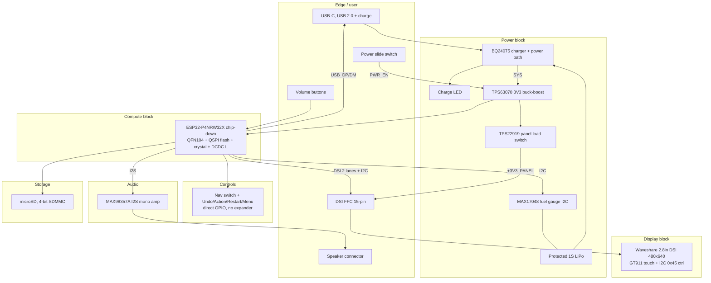

# P4 Handheld — block diagram

Status: circuit phase (2026-07-12). Single custom board, chip-down ESP32-P4;
panel on FFC. Spec: `docs/superpowers/specs/2026-07-12-p4-handheld-circuit-design.md`.

## System overview



## Power tree

```
USB-C VBUS (5 V) ──┬──► BQ24075 charger (CHG pin ──► charge LED from VBUS)
                   │         │
1S LiPo (3.0–4.2 V)┘         ├──► SYS rail
                             │      │
                             │      └──► TPS63070 3V3 buck-boost
                             │             ├──► ESP32-P4 cluster (flash, crystal, DC-DC)
                             │             ├──► Logic: I2C, SDMMC, buttons, I2S amp
                             │             └──► TPS22919 panel load switch ──► +3V3_PANEL
                             │                    (FFC pins 14+15, PANEL_EN gated for sleep)
                             └──► MAX17048 fuel gauge (BAT+ sense, I2C, ALRT)

Power slide switch (SW9, SPDT) ──► buck-boost EN via PWR_EN (ON = SYS, OFF = GND).
Hard off; no latch IC; charging works with the switch off; switch carries no
battery current.
```

## Power budget (re-verify at layout with measured panel numbers)

| Rail | Budget | Notes |
|---|---|---|
| Panel 3V3 | ≤400 mA peak (card baseline; expect lower at 2.8") | integrated backlight on panel, I2C `0x45` control, no board boost |
| P4 cluster | ~250 mA avg, ~500 mA bursts | 400 MHz dual-core + DSI PHY; measure at bring-up |
| Rest | <50 mA | SDMMC, I2C, buttons; amp adds up to ~300 mA at full speaker drive — size 3V3 for concurrent panel+amp peaks |

TPS63070 continuous output comfortably exceeds the concurrent worst case;
the Task 12 gate review re-walks this table with PANEL_RESEARCH numbers.

## Block inventory

| ID | Block | Function | Part class |
|----|-------|----------|------------|
| U1 | Compute | ESP32-P4, 32 MB in-package PSRAM, no radio | ESP32-P4NRW32X (QFN104, **X** revision mandatory) |
| U9/X1/L1 | Compute support | 32 MB QSPI NOR, 40 MHz crystal, DC-DC inductor | per Espressif chip-down reference |
| U2 | Charger | 1S linear charger + power path | BQ24075RGTR |
| U3 | Fuel gauge | SOC %, ALRT | MAX17048G+T10 |
| U4 | Buck-boost | 3V3 rail | TPS63070 |
| U6 | Panel load switch | gate +3V3_PANEL in sleep | TPS22919 |
| U7 | Audio amp | I2S mono class-D, shutdown pin | MAX98357A |
| D4/R8 | Charge LED | from VBUS via charger CHG | 0603 LED |
| J1 | USB-C | USB 2.0 + 5 V charge | HRO TYPE-C-31-M-12 class |
| J2 | Battery | protected 1S connector | gated: GATE-BATTERY-SAMPLE |
| J3 | Panel FFC | 15-pin 1.0 mm RPi-style DSI | FH12-15S class; gated: GATE-PANEL-FFC-CONTACT |
| J4 | microSD | push-push, 4-bit SDMMC | gated: GATE-MICROSD-FOOTPRINT |
| J5 | Speaker | 2-pin, hand-attached speaker | gated: GATE-SPEAKER-SELECT |
| SW1–SW4 | Navigation | four-way + center (center diagnostics-only) | gated: GATE-BUTTON-COUPON |
| SW5–SW8 | Face buttons | Undo/Action/Restart/Menu | gated: GATE-BUTTON-COUPON |
| SW9 | Power | SPDT slide, gates U4 EN | gated: GATE-POWER-SLIDE-SLOT |
| SW10A/B | Volume | edge buttons | gated: GATE-BUTTON-COUPON |
| TP* | Debug | UART0, BOOT, EN, spare GPIOs | test pads, no connector |

Dropped relative to the card: DRV2605/LRA haptics, piezo, case RGB LEDs,
and the SPI-mode SD compromise. Added: I2S amp + speaker, GT911 touch wiring
(disabled in release firmware), 4-bit SDMMC.

## Related files

- `PIN_BUDGET.md` — GPIO map, straps, connector pinouts
- `PANEL_RESEARCH.md` — panel decision + frozen interface facts
- `schematic/connectivity.json` — net source of truth
